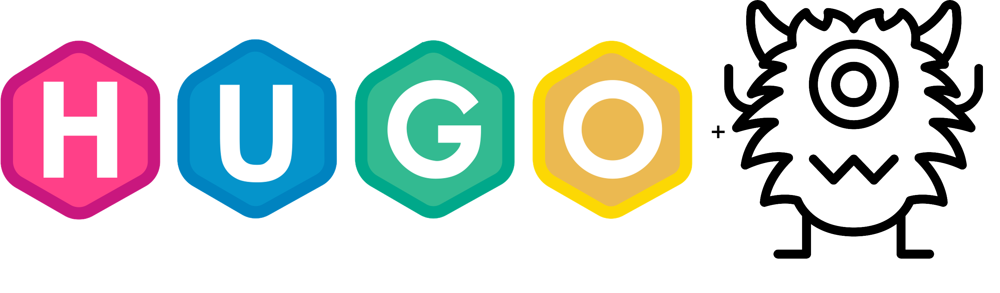

# hugo-metamonster



A little CLI tool to add optimized title, description provided by [metamonster](https://app.metamonster.ai/sites) and keywords to your [Hugo](https://gohugo.io/) content.

## Requirements

- An export from metamonster
- Hugo installed on your computer

## Usage

1. Download the optimized export
2. Download a release and run `hugo-metamonster --help`
3. Profit!

## Notes

The optimized data is added to a `meta` key in each page and can be accessed with:

```go
{{ with .Params.meta }}
<meta name="description" value="{{ .description }}" />
{{ end }}
```